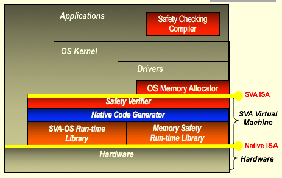
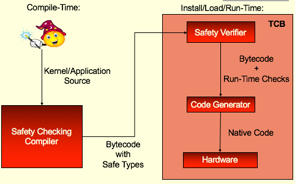

# 论文阅读报告-SVA
> 陈星曼  
> No.2016310602

## 0x00 论文摘要

题目：Secure Virtual Architecture:
A Safe Execution Environment for Commodity Operating Systems

作者：John Criswell, University of Illinois
Andrew Lenharth, University of Illinois
Dinakar Dhurjati, DoCoMo Communications Laboratories, USA
Vikram Adve, University of Illinois

发表：2007，SOSP

这篇文章发表在2007年的SOSP上，主要内容是为操作系统与应用程序提供了一个安全的执行环境，提出了安全虚拟架构（SVA）的概念。

具体地说，SVA定义了适合于在系统上执行内核与应用程序代码的虚拟低级类型指令集，并由虚拟机透明转译而执行。SVA旨在实现细粒度的存储器安全性，控制完整性，对象类型的安全性以及相关的分析。

实现SVA的虚拟机通过一种新颖的方法来实现，利用了内核内存池的属性，与保留内核对内存的明确控制（包括自定义分配器与显式释放）。除此之外，安全属性可以被编码为SVA类型系统的扩展，从而允许包含安全检查的编译器处于可信计算基之外。

SVA还定义了一组操作系统接口操作，抽象所有的特权硬件指令，并允许虚拟机监视所有控制硬件的特权操作。

作者也做了对应的实践工作，将linux内核移植到SVA，并将其视为一个新架构，并对内核和驱动进行了少量代码更改，从而达到了防止Linux 2.4.22内核5个内存安全漏洞中4个被利用的效果（并通过编译额外的扩展防止第5个）。

---

## 0x01 论文内容

论文的主要内容围绕着构造一个足够“安全”的系统展开。作者花费了很大的代价实现了SVA，想要实现的目标有
- 数组索引保留在对象边界内
- 未使用未初始化的变量
- 所有操作都是类型安全的
- 没有使用悬空指针
- 控制流遵循程序语义
- 明确的操作语义

OS 安全性一直也是研究的重点。从10年后的今天来看，就算是操作系统安全防护做得最多（未必是最好）的Windows OS，内存漏洞经常出现，DEP, ASLR, SSP， CFI等等防护仍然存在被绕过的可能。

SVA本质上是一个Compiler-based virtual machine, 本文的贡献主要有以下几点：

- 基于编译器的虚拟机
  - 托管商品操作系统
  - 支持复杂的编译器分析技术
- 为完整商品OS（例如，Linux）提供安全保证的第一系统
  - 保留显式内存释放
  - 保留自定义内核内存分配器

---

### 核心方法

#### 系统架构：

前面提到了SVA定义了适合于在系统上执行内核与应用程序代码的虚拟低级类型指令集，并由虚拟机透明转译而执行。实现虚拟指令集的系统负责验证可执行字节码（或者说虚拟目标代码）是否满足期望的安全属性，我们将该系统称为安全虚拟机（SVM），和以字节码形式执行的虚拟目标代码。

#### SVA的核心组成：

- SVA核心
    - 基于LLVM
    - 归类，显式控制流图，显式SSA form
    - 复杂的编译器分析和转换
- SVA-OS
    - OS“中性”指令，支持商品操作系统
    - 删除难以分析的汇编代码
    - 封装特权操作
    - 类似于移植到一个新的硬件架构

#### SVA安全检查策略

- 安全检查
    - 加载/存储检查
    - 边界检查
    - 非法免费支票
    - 间接呼叫检查

- 安全变换
    - 堆栈到堆促进
    - 内存初始化

#### 实现

1. 首先，对于runtime security check，作者基于前人的工作提出了一些改进的方法，包括只检查单一分区的对象和减少安全指令的检查，提高了一些速度；

2. 同时，按照作者提出的安全策略（细节请参阅原文），对相关的操作添加检查语句，并在内核运行时在lib中予以检查。

---
### 测试与结果

本文在测试SVA的安全性方面，选择了Linux Kernel version 2.4.22来进行测试，移植到了SVA上。

首先Overhead，作者从时间开销和web服务的带宽上进行了测试，效果差强人意，极限情况下产生66.7%的时间开销。

kernel中有5个漏洞，使用SVA则其中四个漏洞可以在被触发时catch，另外一个也可以通过extension防止利用。

---

## 0x02 读后感

这篇文章为了解决内核的安全问题，付出了精力和兼容性等代价，实现了一个Compile based virtual machine。

简而言之，我对这篇文章的印象不是很好。
- 首先，为了“安全”代价过高，overhead和兼容性都是不得不考虑的问题。
- 其次，这些实现的方法我认为还会引入其他的漏洞，这种可能性非常之大。
- 第三，行文晦涩，故事讲的不够好；前半部分多次引用SVA中的一些基本概念，但是没有详细通俗的解释（也有可能是我水平太低）；同时找了ppt来看，逻辑顿时通顺很多。

从我自己的研究角度来看，除去行文上有一些需要改进的地方；如果进一步研究的话，这篇文章可以进一步阐述一下vm check之后确实不可能存在其他漏洞（不可能被绕过）可能会更好一些。

